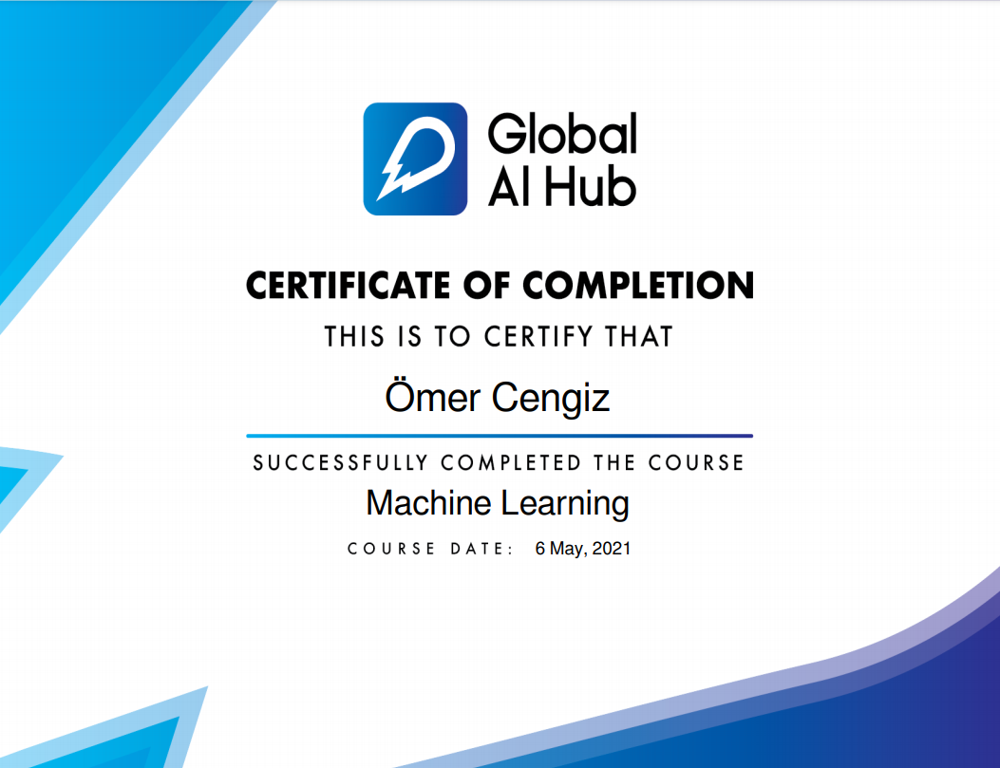

  

# Welcome to our Introduction to Machine Learning Course Repo!

You can find more information about our Introduction to Machine Learning Course by visiting [Course Website.](https://globalaihub.com/introduction-to-machine-learning/)

To enroll our courses, you can find the next course that fit your schedule by visiting [Upcoming Courses.](https://globalaihub.com/upcoming-courses/)

## Syllabus

### Lesson 1
- [Probabilty Review](https://github.com/globalaihub/introduction-to-machine-learning/tree/main/Probabilty)
- [Linear Algebra Review](https://github.com/globalaihub/introduction-to-machine-learning/tree/main/Linear%20Algebra)

### Lesson 2
- [Data Preparation](https://github.com/globalaihub/introduction-to-machine-learning/tree/main/Data%20Prep)
- [Linear Regression](https://github.com/globalaihub/introduction-to-machine-learning/tree/main/Linear%20Regression)

### Lesson 3
- [Logistic Regression](https://github.com/globalaihub/introduction-to-machine-learning/tree/main/Logistic%20Regression)
- [Regularization](https://github.com/globalaihub/introduction-to-machine-learning/tree/main/Regularization)

### Lesson 4
- [Decision Trees](https://github.com/globalaihub/introduction-to-machine-learning/tree/main/Decision%20Trees)

### Lesson 5
- [Unsupervised Learning](https://github.com/globalaihub/introduction-to-machine-learning/tree/main/Unsupervised%20Learning)

## Certification Example

